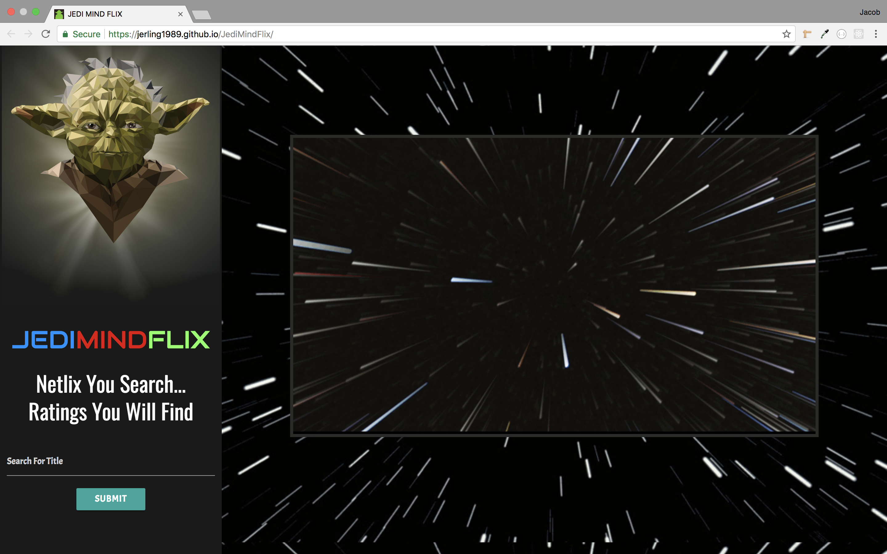
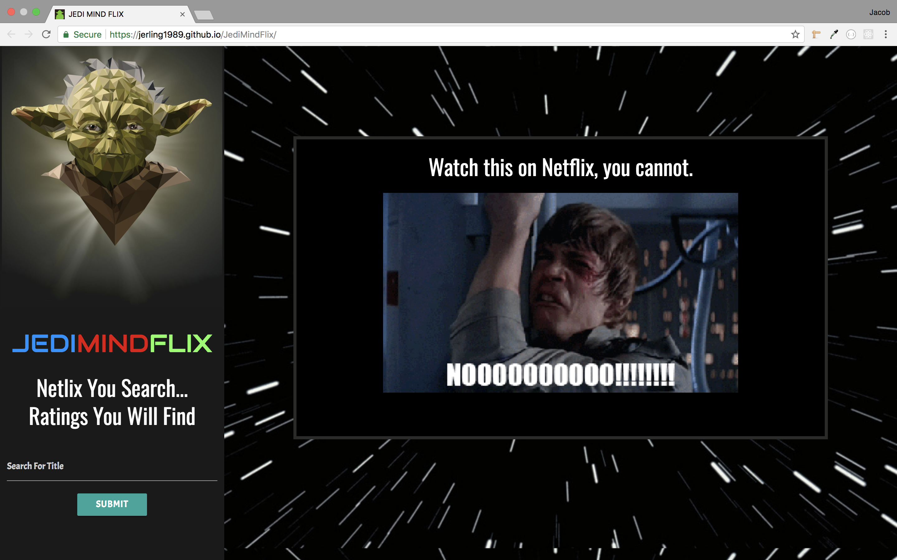

# JediMindFlix
JediMindFlix is an interactive web app made for users to check whats on Netflix. The app is made with HTML and Materialize CSS on the Front-End, with several API's on the backend including "Yoda Speak", "OMDB", and "Netflix Roulette" along with AJAX. Any user can access the app to ask Yoda whether a movie is on Netflix or not, and he will respond in his unique dialect.

*NOTE: The "Netflix Roulette" API originally used to make this app work is no longer available.

---

